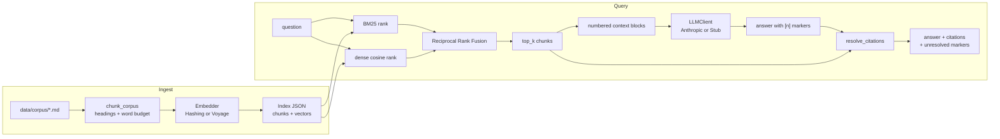

# 01 — Basic RAG

A minimal, production-shaped hybrid retrieval-augmented generation pipeline you can read end to end in one sitting.

This starter is the reference implementation for the other RAG starters in this library: structure-aware chunking, a from-scratch BM25 implementation, a swappable dense embedder, Reciprocal Rank Fusion to combine the two, and grounded generation whose citations are checked against what was actually retrieved rather than trusted blindly. It runs completely offline out of the box — no API key required — and upgrades cleanly once you add one.

## What it does

- Ingests a directory of `.md`/`.txt` files, splitting them into structure-aware chunks (by markdown heading, then by a word budget with overlap).
- Indexes chunks with both BM25 (lexical) and a dense embedder (semantic), persisted to a single JSON file.
- Answers a question by retrieving chunks with hybrid search (BM25 + dense, fused with RRF), asking Claude to answer using only those chunks, and resolving the model's `[n]` citation markers back to real chunk ids and source files.
- Reports (never silently drops) any citation marker the model produced that doesn't match a retrieved chunk.

## Architecture



## When to use it

Use this as a starting point when you need grounded question-answering over a small-to-medium set of text documents and want to understand (and own) every moving part — no vector database, no orchestration framework, one JSON index file you can inspect by hand.

Don't use it as-is for: large corpora (the JSON index and in-memory BM25/cosine scan are fine for thousands of chunks, not millions), documents that are mostly images/tables (see `02-multimodal-rag`), or anything needing access control per-document (there is none here).

## Folder structure

```
starters/01-basic-rag/
  README.md
  pyproject.toml
  .env.example
  src/basic_rag/
    __init__.py
    __main__.py         # python -m basic_rag <subcommand>
    cli.py               # ingest / query / index-info subcommands
    config.py            # frozen Config dataclass from env
    logging_setup.py     # ~20-line JSON line logger
    errors.py            # MissingCredentialsError, EmbedderMismatchError
    chunking.py           # structure-aware chunker
    bm25.py               # from-scratch Okapi BM25 (~60 lines)
    embeddings.py         # HashingEmbedder (default) + VoyageEmbedder
    index.py              # Index build/save/load, embedder selection
    retrieval.py           # HybridRetriever + Reciprocal Rank Fusion
    generation.py          # prompt building + citation resolution
    llm.py                 # LLMClient seam: AnthropicClient / StubClient
  tests/
    test_chunking.py       # headings + overlap boundaries
    test_bm25.py            # ranking sanity on a known corpus
    test_retrieval.py        # RRF fusion ordering
    test_citations.py        # resolution incl. an unresolvable marker
    test_e2e.py               # ingest -> query, stub client, via the CLI
  data/
    corpus/                 # 6 synthetic markdown docs (fictional company handbook)
    corpus.index.json        # generated by `ingest`, gitignored
```

## Prerequisites

- Python 3.11+
- [`uv`](https://docs.astral.sh/uv/) (or `pip`) for installing dependencies
- No API key needed to run the offline demo. An `ANTHROPIC_API_KEY` (from <https://console.anthropic.com/settings/keys>) enables real generation; a `VOYAGE_API_KEY` (from <https://dash.voyageai.com/>) enables real semantic embeddings.

## Setup

```bash
cd starters/01-basic-rag
uv venv --python 3.13
uv pip install -e ".[dev]"
cp .env.example .env   # optional: add real API keys later
```

## Environment variables

| Name                | Required? | Default        | What it is for                                                              |
|----------------------|-----------|----------------|-------------------------------------------------------------------------------|
| `ANTHROPIC_API_KEY`  | No        | unset          | Enables real Claude generation. Without it, `query` falls back to the offline stub (logged). |
| `ANTHROPIC_MODEL`    | No        | `claude-opus-5`| Model id used for generation.                                                 |
| `VOYAGE_API_KEY`     | No        | unset          | Enables real semantic embeddings (`voyage-3.5`) at ingest/query time instead of the hashing embedder. |
| `LLM_PROVIDER`       | No        | `anthropic`    | `anthropic` or `stub`. Forces the LLM backend regardless of API key presence. |
| `LOG_LEVEL`          | No        | `INFO`         | Python logging level for the JSON line logger.                                |
| `TOP_K`              | No        | `5`            | Default number of chunks retrieved per query (overridable with `--top-k`).    |
| `RRF_K`              | No        | `60`           | Default Reciprocal Rank Fusion constant (overridable with `--rrf-k`).         |

## Run it

Offline, no API key, using the bundled sample corpus:

```bash
cd starters/01-basic-rag
uv run basic-rag ingest --offline
uv run basic-rag query "How much is the wellness stipend and how is it different from the equipment stipend?" --offline
uv run basic-rag index-info
```

With a real Claude key (paid call: one `messages.create` per `query`):

```bash
uv run basic-rag ingest          # uses VoyageEmbedder if VOYAGE_API_KEY is set, else hashing
uv run basic-rag query "How much is the wellness stipend?"
```

Also runnable as a module: `uv run python -m basic_rag ingest --offline`.

## Example input

```bash
uv run basic-rag query "How much is the wellness stipend and how is it different from the equipment stipend?" --offline
```

The sample corpus (`data/corpus/`) is a six-document fictional employee handbook for "Northlight Robotics," written with deliberate cross-references (the wellness stipend, equipment stipend, and parental leave are each mentioned in more than one document) so hybrid retrieval has something real to fuse.

## Expected output

Real output from the command above, trimmed for length (full run has 5 citations; shown here truncated per-chunk snippet, matching the actual `--offline` behavior):

```
[stub] Grounded answer for: 'How much is the wellness stipend and how is it different from the equipment stipend?' Every employee receives a $50 per month wellness stipend, reimbursable for gym memberships, therapy co-pays, or fitness equipment. This is separate from the one-time home office equipment stipend described in the Remote ... [1] Remote employees receive a one-time $500 home office equipment stipend to cover a desk, chair, monitor, or other hardware...[2] ...

Citations:
  [1] -> 01-benefits.md (chunk 6a0621106ef1)
  [2] -> 03-remote-work.md (chunk 2df563a6cec8)
  [3] -> 05-onboarding.md (chunk af7fad4dde54)
  [4] -> 04-expenses.md (chunk 09190bbb4892)
  [5] -> 01-benefits.md (chunk 4e96e0d8cbac)
```

`index-info` output:

```json
{
  "index_path": "data/corpus.index.json",
  "chunk_count": 29,
  "source_count": 6,
  "sources": [
    "00-company-overview.md",
    "01-benefits.md",
    "02-time-off.md",
    "03-remote-work.md",
    "04-expenses.md",
    "05-onboarding.md"
  ],
  "embedder": "hashing",
  "embedder_dim": 256
}
```

## How the flow works

**Chunking (`chunking.py`)** splits markdown by ATX headings first (`#`..`######`), tracking a heading stack so each chunk knows its full heading trail (e.g. `["Benefits", "Wellness stipend"]`). Within each heading section, a word-budget splitter (180 words, 40-word overlap by default) breaks long sections into overlapping windows so no single chunk straddles two unrelated topics, and no fact gets stranded at a chunk boundary. Files without headings fall back to one section per file.

**Retrieval is hybrid on purpose.** Anthropic has no embeddings endpoint. This starter's default embedder, `HashingEmbedder`, is a hashed bag-of-words with **no semantic understanding whatsoever** — it cannot tell "car" and "automobile" are related. Alone, it would give mediocre results. So retrieval always runs a real from-scratch Okapi BM25 (`bm25.py`, ~60 lines) alongside the dense ranking, and fuses the two rank-ordered lists with Reciprocal Rank Fusion (`retrieval.py`): `score(doc) = sum(1 / (k + rank))` across each ranking. RRF only needs rank positions, not comparable score scales, so it fuses lexical and dense signals without any tuning. BM25 does essentially all the useful work offline; dense similarity becomes a genuine second opinion once you set `VOYAGE_API_KEY` and switch to real semantic embeddings.

**The index is one JSON file.** `Index.save`/`Index.load` persist chunks and dense vectors; BM25 is cheap enough (milliseconds for this corpus size) to rebuild from the persisted chunk texts every time a `HybridRetriever` is constructed, so there's nothing BM25-specific to serialize.

**Generation and citations (`generation.py`, `llm.py`).** Retrieved chunks are numbered into context blocks and given to the model with a system prompt that requires `[n]` citations and permits "I don't know." `resolve_citations` then regex-scans the answer for `[n]` markers and maps each one back to the real chunk id and source file it refers to. A marker the model invented — pointing past the last retrieved block — is reported in `unresolved_markers` rather than dropped, so a broken citation is visible instead of silently wrong.

**Offline-first (`llm.py`).** `StubClient` never touches the network: it builds its answer by concatenating a truncated snippet of each *actually retrieved* chunk with its citation marker. It is prefixed `[stub]` so it is never mistaken for a real model response, but it is genuinely derived from the real retrieval result, not lorem ipsum. `get_client()` picks `AnthropicClient` when `ANTHROPIC_API_KEY` is set and `LLM_PROVIDER` isn't forced to `stub`; otherwise it logs one INFO line and falls back to the stub. `--offline` always forces the stub, and also forces the hashing embedder for both `ingest` and `query`.

## Extension ideas

- Swap the JSON index for pgvector or Qdrant once corpus size outgrows an in-memory numpy scan; `Index`/`HybridRetriever` are the two places to change.
- Add a re-ranking step (e.g. a cheap cross-encoder or a Claude call with `output_config={"effort": "low"}`) between RRF fusion and the final `top_k` cut.
- Chunk by sentence boundaries instead of raw word count for cleaner chunk edges.
- Cache `HashingEmbedder`/`VoyageEmbedder` vectors for repeated queries within a session.

## Limitations

- `HashingEmbedder` has no semantic understanding at all — it is a hashed bag-of-words. Retrieval quality for paraphrased or synonym-heavy queries depends entirely on BM25 until `VOYAGE_API_KEY` is set.
- The JSON index is not designed for large corpora: everything loads into memory and BM25 is rebuilt on every process start. Fine for the demo corpus (29 chunks); not a production index format.
- No incremental indexing — `ingest` rebuilds the whole index from the corpus directory every time.
- No access control, no multi-tenant isolation, no citation confidence scoring.
- Chunking is word-count based, not token-accurate for any specific tokenizer; it's a "token-ish" budget, not an exact one.

## Troubleshooting

| Symptom | Cause | Fix |
|---|---|---|
| `No index found at data/corpus.index.json. Run \`ingest\` first.` | `query`/`index-info` ran before `ingest`. | Run `uv run basic-rag ingest --offline` (or without `--offline` if you have keys). |
| `Error: VOYAGE_API_KEY is not set...` | Queried an index that was built with the Voyage embedder, but `VOYAGE_API_KEY` isn't set in this environment (and `--offline` wasn't passed either). | Set `VOYAGE_API_KEY` in `.env` to match the key used at ingest time, or re-run `ingest --offline` to rebuild a hashing-based index. |
| `Error: Index was built with the 'voyage' embedder, which needs network access...` | Index was built with Voyage embeddings, then queried with `--offline`. | Re-run `ingest --offline` to rebuild a hashing-based index, or drop `--offline` and keep `VOYAGE_API_KEY` set. |
| `{"level": "INFO", ... "falling back to StubClient" ...}` on stderr | `ANTHROPIC_API_KEY` not set and `query` run without `--offline`. | Expected — the stub still answers. Set `ANTHROPIC_API_KEY` for real generation. |
| Unresolved citation marker warning on stderr | The model (or stub) emitted an `[n]` outside the retrieved context range. | Inspect the printed `Citations:` list; this is intentionally surfaced, not hidden. |

## Production hardening

- Add retry/backoff around `AnthropicClient` calls (currently a single attempt; errors are caught and re-raised with a clear message but not retried).
- Move the index to a real vector store with metadata filtering once corpus size or concurrent query volume grows.
- Add authentication and rate limiting if this is exposed as a service rather than run as a CLI.
- Track retrieval/generation latency and citation-resolution rate as production metrics.
- Version the index format (`IndexMetadata`) so old JSON indexes fail loudly instead of silently misbehaving after a schema change.
