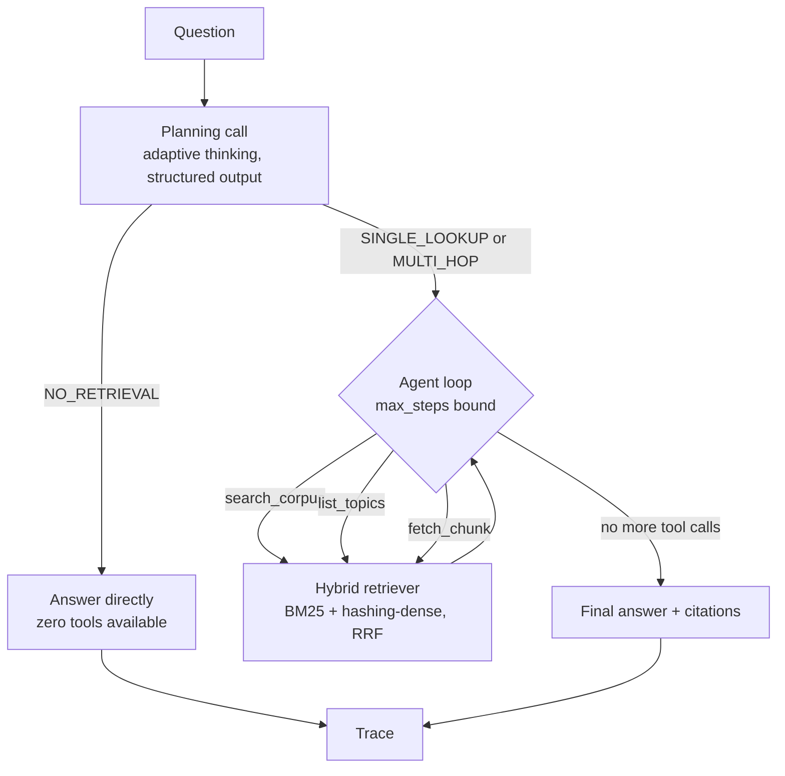

# 03 — Agentic RAG

An agent that decides whether and how to retrieve, instead of retrieving on every turn.

Most RAG demos search the corpus unconditionally, even for questions the corpus has nothing to
do with, and even for questions that need one lookup versus several. This starter makes that
decision explicit: a planning step classifies each question as `NO_RETRIEVAL`, `SINGLE_LOOKUP`,
or `MULTI_HOP` before any search happens, and the classification actually changes what runs
next. A `NO_RETRIEVAL` question never touches the corpus. A `MULTI_HOP` question can issue a
second search that is genuinely informed by what the first one returned. Every decision --
the plan, every tool call, why the run stopped -- is captured in a machine-readable trace.

## What it does

Given a question, the agent:

1. Runs a planning call that classifies the question and drafts search sub-queries.
2. If the plan says `NO_RETRIEVAL`, answers directly -- the model is called with no tools at
   all, so it is structurally incapable of searching the corpus.
3. Otherwise, enters a bounded tool loop (hard `max_steps`, default 6) with three tools:
   `search_corpus` (hybrid BM25 + dense retrieval), `list_topics` (what the corpus actually
   covers, to tell "not in corpus" from "no results"), and `fetch_chunk` (neighbouring context
   around a promising hit).
4. For a multi-hop question, the second search is chosen from what the first search actually
   returned, not pre-planned in advance.
5. Produces a final answer with citations to real chunk ids, and refuses to keep a citation
   that points at a chunk it never actually retrieved.

## Architecture



## When to use it

Use this when retrieval is expensive or noisy enough that calling it unconditionally would hurt
-- e.g. a corpus mixed with genuinely off-topic questions, or questions that sometimes need
several hops and sometimes need none. The visible plan-then-act structure is also a reasonable
starting point for anyone who wants to see *why* an agent did or didn't retrieve.

Don't use it as-is when the corpus is always relevant to every question (the planning call is
pure overhead there -- go straight to retrieval), or when you need real semantic search: the
default embedder is a hashed bag-of-words with no understanding of meaning (see Limitations).

## Folder structure

```
03-agentic-rag/
  src/agentic_rag/
    bm25.py           # Okapi BM25, ~60 lines, no dependencies
    embeddings.py      # HashingEmbedder (default, offline) + VoyageEmbedder (upgrade path)
    retrieval.py         # corpus loading/chunking, hybrid search, RRF fusion, JSON persistence
    tools.py               # strict tool schemas + dispatcher (search_corpus/list_topics/fetch_chunk)
    schemas.py               # QueryPlan, trace, and agent-step data shapes
    llm.py                     # LLMClient protocol, AnthropicClient, StubClient, get_client()
    stub_logic.py                # deterministic offline heuristics behind StubClient
    agent.py                      # the bounded plan-then-act loop + citation resolution
    cli.py                         # query | plan | trace
    config.py, logging_setup.py, errors.py
  data/                # 6 short markdown docs; overview.md -> teams.md is the multi-hop pair
  tests/
```

## Prerequisites

- Python 3.11+
- [uv](https://docs.astral.sh/uv/) (or pip)
- No API key required to run the demo. An Anthropic API key is only needed for real model calls.

## Setup

```bash
cd starters/03-agentic-rag
uv venv --python 3.13
uv pip install -e ".[dev]"
cp .env.example .env   # optional -- only needed for real API calls
```

## Environment variables

| Name | Required? | Default | What it is for |
|---|---|---|---|
| `ANTHROPIC_API_KEY` | No (required for real model calls) | unset | Anthropic API key. Without it, the CLI falls back to the offline stub automatically. |
| `ANTHROPIC_MODEL` | No | `claude-opus-5` | Model id used for planning and agent-loop calls. |
| `LLM_PROVIDER` | No | unset (auto) | `anthropic` or `stub`. Auto-picks `anthropic` when a key is set, else `stub`. |
| `VOYAGE_API_KEY` | No | unset | Activates `VoyageEmbedder` for real semantic embeddings instead of the hashing embedder. |
| `AGENTIC_RAG_DATA_DIR` | No | `./data` | Where the corpus markdown files are read from. |
| `AGENTIC_RAG_TRACE_PATH` | No | a temp-dir file | Where `query` writes its trace and `trace` reads it from. |
| `AGENTIC_RAG_MAX_STEPS` | No | `6` | Hard cap on agent-loop steps. |
| `LOG_LEVEL` | No | `INFO` | `DEBUG`, `INFO`, `WARNING`, or `ERROR`. |

## Run it

All commands work offline with `--offline` and make no network calls or paid API requests in
that mode. Without `--offline`, `query` and `plan` make one or two calls to the Claude API
(the planning call, plus one call per agent-loop step -- at most `max_steps` + 1 calls).

```bash
# No-retrieval: answered directly, zero tool calls.
uv run agentic-rag plan "What is 2 + 2?" --offline

# Single-hop: one search should find it.
uv run agentic-rag query "What is Nimbus?" --offline

# Multi-hop: fact A (overview.md) points at entity B (teams.md).
uv run agentic-rag query "Who rebuilt Nimbus's caching layer, and what other systems does that team own?" --offline

# Pretty-print the trace from the last `query` run.
uv run agentic-rag trace
```

## Example input

```
Who rebuilt Nimbus's caching layer, and what other systems does that team own?
```

## Expected output

Real output from `uv run agentic-rag query "..." --offline` (log lines and the trace-write
notice trimmed):

```
(offline stub) Caching Layer History
Nimbus originally cached merchant risk profiles in a local in-memory map on each consumer node,
which caused inconsistent scores across nodes during deploys. [overview::1] Aurora Team
The Aurora team owns shared caching infrastructure used across the payments group. [teams::0] Aurora Team
The Aurora team owns shared caching infrastructure used across the payments group. [teams::0]

Citations: overview::1, teams::0
```

And `uv run agentic-rag plan "What is 2 + 2?" --offline`:

```json
{
  "classification": "NO_RETRIEVAL",
  "reasoning": "None of the question's terms appear anywhere in the corpus vocabulary (architecture, deployment, incidents, overview, roadmap, teams); this reads as general knowledge.",
  "sub_queries": []
}
```

## How the flow works

**Planning happens before any tool exists in the model's hands.** For `NO_RETRIEVAL`, the
follow-up call to answer the question is made with `tools=[]` -- not a prompt instruction asking
the model to "not use tools," which a model can ignore, but an empty tool list, which makes
tool use structurally impossible. That is what the "no-retrieval path makes zero tool calls"
test actually verifies.

**Hybrid retrieval, not just dense.** Anthropic has no embeddings endpoint. The default
`HashingEmbedder` is a hashed bag-of-words projected into a fixed dimension -- it has zero
semantic understanding; two sentences sharing no words score zero similarity even if they mean
the same thing. BM25 (`bm25.py`) does the real work offline: exact and near-exact term overlap,
weighted by term rarity and normalized for document length. The two are fused with Reciprocal
Rank Fusion (rank-based, not score-based, so the very different score scales of BM25 and cosine
similarity never need to be reconciled). Once `VOYAGE_API_KEY` is set, `VoyageEmbedder` swaps in
real semantic embeddings and the fusion gets meaningfully better on paraphrased queries.

**The second hop is genuinely informed by the first search**, not two pre-planned queries fired
blind. The offline stub demonstrates this concretely: it scans the body text of the first
search's top hits for a capitalized term that was not already in the question (skipping the
chunk's own heading, which would otherwise produce false positives like "History" or
"Components"), and searches for that term next. In the example above, "Aurora" is not in the
original question -- the first search surfaces it, and the second search is built from it.

**Citations are resolved, not trusted.** The final answer is scanned for `[chunk_id]` patterns,
and only ids that were *actually retrieved this run* (search results or fetched chunks) and
that exist in the corpus survive into the reported citation list. `agent.resolve_citations` is
directly unit-tested with an invented id mixed into real ones.

**The trace is a first-class artifact**, not a debug log. It's a `RunTrace` with one entry per
decision (`plan`, each `tool_call`, `final` or `bound_hit`), serialized to JSON on every
`query` run and re-printable with `trace`.

## Extension ideas

- Swap `HashingEmbedder` for `VoyageEmbedder` and compare retrieval quality on a paraphrased
  version of the multi-hop question.
- Add a fourth classification tier for "needs three or more hops" and see how the trace grows.
- Persist the retriever index with `HybridRetriever.save`/`.load` (already implemented) and
  wire it into the CLI so large corpora don't get re-embedded on every invocation.
- Feed `list_topics()` results into the planning call itself (currently it's used but the model
  could also be given the freedom to call it mid-loop, which the tool already supports).

## Limitations

- `HashingEmbedder` has no semantic understanding whatsoever -- it is a hashing trick over exact
  words, not a real embedding model. It will miss paraphrases and synonyms; that's why BM25
  carries the offline retrieval, not the dense side.
- The offline `StubClient`'s classification and entity-extraction heuristics are tuned to be
  honestly plausible for the bundled corpus, not a general-purpose NLU system. It is clearly
  labelled offline stub output (every stub answer is prefixed `(offline stub)`) and exists for
  demos and tests, not as a substitute for the real model.
- The corpus is 6 short markdown files. Chunking is heading-boundary based, which works well for
  small structured documents and would need revisiting (e.g. token-budget-based splitting) for
  long, unstructured ones.
- `max_steps` bounds the loop but does not guarantee a *complete* answer -- if the bound is hit,
  the run says so plainly rather than fabricating a finished-looking answer.

## Troubleshooting

| Symptom | Cause | Fix |
|---|---|---|
| `error: ANTHROPIC_API_KEY is not set...` | `LLM_PROVIDER=anthropic` was set explicitly but no key is configured | Set `ANTHROPIC_API_KEY`, or unset `LLM_PROVIDER` to allow the stub fallback, or pass `--offline` |
| CLI prints a stub answer even though `ANTHROPIC_API_KEY` is set | `--offline` was passed | Drop `--offline` |
| `agentic-rag trace` says "No trace found" | `query` was never run in this environment, or `AGENTIC_RAG_TRACE_PATH` changed between runs | Run `agentic-rag query "..."` first |
| `CorpusNotFoundError` | `AGENTIC_RAG_DATA_DIR` points at a directory with no `*.md` files | Point it at `data/`, or check the override env var |
| Multi-hop question only produces one search | The question does not match the stub's " and what/who/..." pattern | Rephrase as an explicit two-clause question, or use the real model, which does not depend on that heuristic |

## Production hardening

- Add retries with backoff around `messages.create`/`messages.parse` beyond the SDK's built-in
  retry (the SDK already retries 429/5xx/connection errors; this starter does not add more).
- Replace the in-memory numpy vector store with a real vector database (pgvector, Qdrant) once
  the corpus outgrows what fits comfortably in memory, keeping the same `Embedder` interface.
  Storing the persisted JSON index in an actual database rather than a single file would also
  make it safe for concurrent readers.
- Add a token/cost budget to the agent loop alongside the step-count bound, so a run that keeps
  calling tools with small inputs can't run away on cost even within `max_steps`.
- Rate-limit and authenticate the CLI/API surface before exposing it beyond local use, and scrub
  question text before logging it if the corpus or questions may contain sensitive data.
