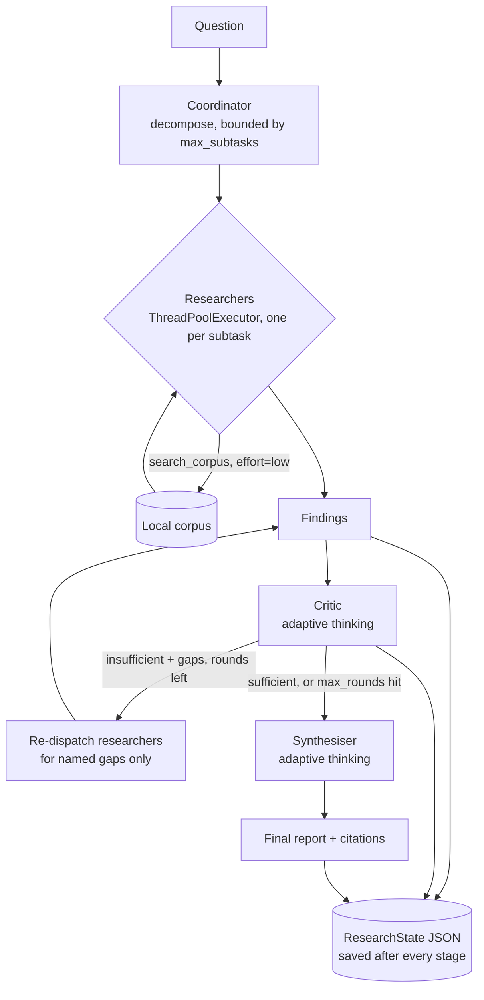

# 04 — Multi-Agent Research

A coordinator that splits a question into independent subtasks, researchers that chase them down in parallel, a critic that decides if the answers are actually good enough, and a synthesiser that turns whatever came back into one cited report.

Most "multi-agent" demos either run everything sequentially and call it a team, or hide the coordination logic behind a framework you can't inspect. This starter does neither: every stage — plan, findings, critique, revision, report — is a plain Python dataclass serialized to JSON after it runs, so `show <run-id>` can display exactly how far a run got even if a later stage fails. Researchers genuinely run at the same time via `ThreadPoolExecutor`, not a for-loop dressed up as concurrency. And the critique-and-revise loop is bounded: if the critic is still unhappy after `max_rounds`, the run says so and ships the best report it has, instead of looping forever chasing a perfect answer.

## What it does

Given a question, the pipeline:

1. **Coordinator** decomposes the question into independent subtasks (bounded by `max_subtasks`, default 4), one per researcher, with structured output.
2. **Researchers** run all subtasks concurrently in a `ThreadPoolExecutor`. Each gets its own bounded search-then-answer tool loop over a local markdown corpus (`output_config={"effort": "low"}` — cheap workers), and returns a finding with the sources it actually retrieved.
3. **Critic** reviews the collected findings against the original question and returns a structured verdict: `is_sufficient: bool` plus specific, named gaps if not.
4. **Revision loop**: if insufficient, new researchers are dispatched for exactly the named gaps — not the whole question again. Capped at `max_rounds` (default 2); if the cap is hit while still insufficient, the run terminates cleanly with `termination_reason="max_rounds_reached"` rather than looping.
5. **Synthesiser** writes the final report from every finding collected so far, with adaptive thinking, citing only `doc_id`s that a researcher actually retrieved — a citation the model proposes but that has no matching source is dropped, not trusted.

## Architecture



## When to use it

Use this when a question genuinely decomposes into independent pieces that benefit from being researched in parallel, and when "good enough" is a real judgment call worth a dedicated critique step rather than a single pass. The explicit, disk-persisted state is also a reasonable pattern for anything long-running enough that you want to inspect progress mid-run or after a crash.

Don't use it for questions that don't decompose (a single-focus question just pays the coordination overhead for nothing — see starter 03's plan-then-act agent instead), or where subtasks genuinely depend on each other's answers (this pipeline assumes independence; a dependent pipeline needs a DAG, not a flat subtask list).

## Folder structure

```
04-multi-agent-research/
  src/multi_agent_research/
    schemas.py          # Subtask, SubtaskPlan, Critique, SynthesisReport, tool-call data shapes
    corpus.py            # loads data/*.md, plain stopword-filtered term-overlap search
    coordinator.py         # decompose() -- question -> bounded SubtaskPlan
    researcher.py            # bounded search-then-answer tool loop, run concurrently
    critic.py                  # review_findings() -- structured sufficiency verdict
    synthesizer.py               # synthesize() -- final cited report, adaptive thinking
    orchestrator.py                 # run_research() -- wires the above, persists state each stage
    state.py                          # ResearchState dataclass, JSON save/load
    llm.py                             # LLMClient protocol, AnthropicClient, StubClient, get_client()
    stub_logic.py                       # deterministic offline heuristics behind StubClient
    cli.py                                # research | show | list
    config.py, logging_setup.py, errors.py
  data/                # 5 short markdown docs on EV battery supply-chain risk
  tests/
```

## Prerequisites

- Python 3.11+
- [uv](https://docs.astral.sh/uv/) (or pip)
- No API key required to run the demo. An Anthropic API key is only needed for real model calls.

## Setup

```bash
cd starters/04-multi-agent-research
uv venv --python 3.13
uv pip install -e ".[dev]"
cp .env.example .env   # optional -- only needed for real API calls
```

## Environment variables

| Name | Required? | Default | What it is for |
|---|---|---|---|
| `ANTHROPIC_API_KEY` | No (required for real model calls) | unset | Anthropic API key. Without it, the CLI falls back to the offline stub automatically. |
| `ANTHROPIC_MODEL` | No | `claude-opus-5` | Model id used for every stage. |
| `LLM_PROVIDER` | No | unset (auto) | `anthropic` or `stub`. Auto-picks `anthropic` when a key is set, else `stub`. |
| `MAR_DATA_DIR` | No | `./data` | Where the corpus markdown files are read from. |
| `MAR_RUNS_DIR` | No | a temp dir | Where run-state JSON files are written to and read from. |
| `MAR_MAX_SUBTASKS` | No | `4` | Hard cap on how many subtasks the coordinator may propose. |
| `MAR_MAX_ROUNDS` | No | `2` | Hard cap on critique-and-revise rounds. |
| `MAR_RESEARCHER_MAX_STEPS` | No | `3` | Hard cap on each researcher's tool-loop steps. |
| `ENABLE_WEB_SEARCH` | No | `false` | Lets researchers also use Anthropic's paid, server-executed `web_search` tool. Ignored offline. |
| `LOG_LEVEL` | No | `INFO` | `DEBUG`, `INFO`, `WARNING`, or `ERROR`. |

## Run it

All commands work offline with `--offline` and make no network calls in that mode. Without `--offline`, `research` makes one coordinator call, one critic call per round, one synthesiser call, and up to `researcher_max_steps` calls per researcher per round — for the default corpus and bounds, roughly 10-20 calls total.

```bash
# Full pipeline, offline, against the sample corpus.
uv run multi-agent-research research "How risky is the EV battery supply chain, and what mitigates that risk?" --offline

# List every saved run.
uv run multi-agent-research list

# Print the full saved state (plan, every finding, every critique, the final report) for one run.
uv run multi-agent-research show <run-id>
```

## Example input

```
How risky is the EV battery supply chain, and what mitigates that risk?
```

## Expected output

Real, trimmed output from `uv run multi-agent-research research "..." --offline` (log lines and most repeated finding sections trimmed):

```
Run id: fbadefec9ab0
Rounds: 2  Termination: sufficient

(offline stub) Synthesis for: How risky is the EV battery supply chain, and what mitigates that risk?

### geopolitics
(offline stub) Geopolitical Risk in the Battery Supply Chain: ... [geopolitics][manufacturing]

### gap-2-0
(offline stub) Battery Recycling and Second Life: ... [recycling][geopolitics]

Sources used: geopolitics, manufacturing, mining, mitigation, recycling
```

The bundled corpus has 5 topic documents; the default `MAR_MAX_SUBTASKS=4` means round 1 always misses one. The critic catches it, a `gap-2-*` subtask is dispatched for exactly that topic, and round 2 closes it — which is why this run took 2 rounds and ended `sufficient` with all 5 sources covered.

Forcing the hard cap (`MAR_MAX_SUBTASKS=1 MAR_MAX_ROUNDS=1`) instead terminates after round 1 without a full revision:

```
{"level": "WARNING", "msg": "Hit max_rounds with unresolved gaps; synthesizing with what was found.", "max_rounds": 1, "gaps": ["No findings cover: Raw Material Sourcing (mining)", "No findings cover: Mitigation Strategies (mitigation)", "No findings cover: Battery Recycling and Second Life (recycling)"]}
Run id: b9f9fc0221c3
Rounds: 1  Termination: max_rounds_reached
```

## How the flow works

**State is a first-class artifact, not a debug log.** `ResearchState` is saved to disk after the coordinator's plan, after every round's findings, after every critique, and after the final report. `show <run-id>` reads that file directly, so a run that crashes mid-pipeline is still fully inspectable up to its last completed stage.

**Researchers run concurrently for real.** `run_researchers_concurrently` submits every subtask to its own `ThreadPoolExecutor` worker and collects results with `as_completed`. `tests/test_researcher.py` proves this isn't sequential-in-disguise: it wraps the stub client with an artificial per-call delay and asserts wall-clock time for 5 subtasks stays well under what 5 sequential runs would cost.

**The revision loop targets gaps, not the whole question again.** When the critic returns `is_sufficient=False`, the orchestrator builds new subtasks directly from `critique.gaps` — one researcher per named gap — rather than re-running the original decomposition. This keeps each revision round cheap and focused.

**The bound is enforced twice, same as starter 03's pattern.** `max_subtasks` is stated in the coordinator's prompt *and* truncated again in code after the model responds. `max_rounds` is a hard loop bound in `orchestrator.run_research` — when it's hit with the critic still unsatisfied, the run logs a warning, sets `termination_reason="max_rounds_reached"`, and still synthesises a report from whatever was found, rather than either looping forever or returning nothing.

**Citations are verified, not trusted.** `synthesizer.synthesize` computes the set of `doc_id`s that researchers actually retrieved this run, then drops any citation the model proposes that isn't in that set — the same "don't invent a citation" contract used elsewhere in this collection (see starter 03's README).

**The offline stub is honestly a stub.** `stub_logic.py` ties the coordinator's decomposition directly to corpus topics (one subtask per topic document, up to `max_subtasks`) so the gap-then-revise flow is concrete and reproducible: if the corpus has more topics than the bound allows, the leftover topic is *exactly* the gap the critic will catch. Every stub answer is prefixed `(offline stub)`.

## Extension ideas

- Swap the plain term-overlap `Corpus.search` for the hybrid BM25 + dense retriever from starter 03 if the corpus grows past a handful of short documents.
- Add a token/cost budget alongside `max_rounds` so a run with many cheap-but-numerous researcher calls can't run away on cost even within the round bound.
- Let the critic name *which subtask* a gap belongs to (not just a corpus topic) so revision can also re-run an existing subtask with a refined query, not only spin up brand-new ones.
- Persist findings incrementally per-researcher (not just per-round) so `show` can display partial progress while a round is still in flight.

## Limitations

- `Corpus.search` is deliberately simple stopword-filtered term overlap, not the hybrid BM25 + dense pipeline in starter 03 — this starter is about coordination and critique, not retrieval quality. See that starter's README for the fuller retrieval approach.
- The offline `StubClient`'s decomposition and critique heuristics are tied to the bundled corpus's topic structure. They are honestly labelled offline stub output (every stub answer is prefixed `(offline stub)`) and exist for demos and tests, not as a substitute for the real model's judgment.
- `max_rounds` bounds the loop but does not guarantee a *complete* answer — if the bound is hit, the run says so plainly (`termination_reason="max_rounds_reached"`) rather than fabricating a finished-looking report.
- Token/cost usage is only tracked for researcher calls (the ones that go through `agent_step`, which reports usage); coordinator, critic, and synthesiser calls go through `structured()`, which does not surface usage from the underlying SDK response.
- Web search (`ENABLE_WEB_SEARCH=true`) is a paid, server-executed Anthropic tool and cannot run offline; it is silently skipped (with a log line) when `--offline` is passed.

## Troubleshooting

| Symptom | Cause | Fix |
|---|---|---|
| `error: ANTHROPIC_API_KEY is not set...` | `LLM_PROVIDER=anthropic` was set explicitly but no key is configured | Set `ANTHROPIC_API_KEY`, or unset `LLM_PROVIDER` to allow the stub fallback, or pass `--offline` |
| CLI prints a stub report even though `ANTHROPIC_API_KEY` is set | `--offline` was passed | Drop `--offline` |
| `multi-agent-research show <id>` says "No run found" | Wrong run id, or `MAR_RUNS_DIR` changed between the `research` run and the `show` call | Run `multi-agent-research list` to see valid ids in the current `MAR_RUNS_DIR` |
| `CorpusNotFoundError` | `MAR_DATA_DIR` points at a directory with no `*.md` files | Point it at `data/`, or check the override env var |
| A run always ends `max_rounds_reached` | `MAR_MAX_SUBTASKS` is set low relative to the corpus's topic count, or `MAR_MAX_ROUNDS` is `1` | Raise `MAR_MAX_SUBTASKS` closer to the corpus's topic count, or raise `MAR_MAX_ROUNDS` |

## Production hardening

- Add retries with backoff around every `messages.create`/`messages.parse` call beyond the SDK's built-in retry (already retries 429/5xx/connection errors; this starter adds none).
- Replace the flat-file `ResearchState` JSON persistence with a real database once run volume grows past what a single-writer temp directory can safely handle concurrently.
- Add a token/cost budget to the orchestrator loop alongside `max_rounds`, so a run with many small researcher calls can't run away on cost even within the round bound.
- Rate-limit and authenticate the CLI/API surface before exposing it beyond local use, and scrub question text before logging it if the corpus or questions may contain sensitive data.
