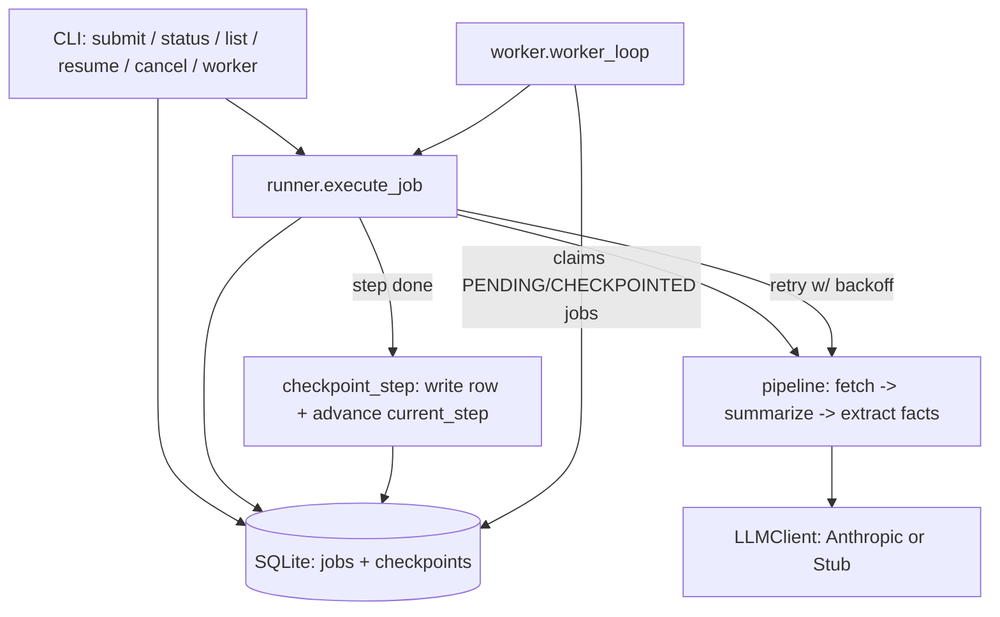

# 05 — Long-Running Agent

A checkpointed, resumable job runner for AI work that takes longer than one request-response cycle.

Some agentic tasks -- processing dozens of documents, running a multi-step research
pipeline, anything that takes minutes instead of seconds -- shouldn't live entirely in
one process's memory. If that process dies partway through, you want to pick up from
the last completed step, not start over and re-pay for work you already did. This
starter shows the pattern: persistent job state and per-step checkpoints in SQLite,
a validated status state machine, retry with backoff for transient failures, and both
a synchronous "block until done" mode and a background polling worker.

## What it does

Submits a job made of N+1 discrete, resumable steps: for each of N "sources" (fetched
locally, simulated -- no real network calls), fetch -> summarize with Claude -> extract
key facts; then one final roll-up synthesis step across everything. Every step is
checkpointed to SQLite before the next one starts. A step that raises is retried with
exponential backoff up to a configurable limit before the whole job is marked FAILED
with the error recorded. Killing the process mid-job and resuming it picks up exactly
where it left off -- proven with a real crash-then-resume test, not just asserted.

## Architecture



## When to use it

Use this pattern when a job has multiple independent steps worth persisting
individually, when steps call an external/paid API you don't want to redo on retry,
or when the job might legitimately outlive the process that started it (a deploy,
a crash, a laptop closing). Skip it for anything that finishes in one API call --
the SQLite bookkeeping is pure overhead there. This is also not a distributed job
queue: `worker` is a single-process polling loop with no locking or leases, so
running multiple workers against the same database can double-claim a job. See
"Production hardening" for what a real deployment would add.

## Folder structure

```
starters/05-long-running-agent/
  src/long_running_agent/
    models.py          # JobStatus enum + validated state machine, Job/Checkpoint dataclasses
    store.py            # SQLite persistence: jobs + checkpoints tables, atomic transitions
    pipeline.py          # the concrete job: fetch/summarize/extract per source, then synthesize
    llm.py                # LLMClient seam: AnthropicClient (real) and StubClient (offline)
    runner.py             # execute_job: resumable step loop, retry/backoff, crash simulation
    worker.py             # background polling loop (drain-once or continuous, bounded)
    cli.py                 # submit / status / list / resume / cancel / worker
    config.py               # frozen Config dataclass from env
    logging_setup.py         # JSON-line structured logging
    errors.py                 # named exceptions
  tests/                       # see "How the flow works" -- crash/resume test is the main one
  data/sources.json              # the same sample sources used as the built-in default
```

## Prerequisites

- Python 3.11+
- `uv` (recommended) or `pip`
- An Anthropic API key only if you want the real (non-`--offline`) model calls

## Setup

```bash
cd starters/05-long-running-agent
cp .env.example .env   # optional -- only needed for the non---offline path
uv venv && uv pip install -e ".[dev]"
```

## Environment variables

| name | required? | default | what it is for |
|---|---|---|---|
| `ANTHROPIC_API_KEY` | no | unset | real model calls; without it, falls back to the offline stub automatically |
| `ANTHROPIC_MODEL` | no | `claude-opus-5` | model id for real calls |
| `LLM_PROVIDER` | no | `anthropic` | `anthropic` or `stub`; `stub` forces offline mode without `--offline` |
| `LOG_LEVEL` | no | `INFO` | structured JSON log verbosity |
| `LONG_RUNNING_AGENT_DB` | no | `long_running_agent.db` | path to the SQLite job database |
| `MAX_RETRIES` | no | `3` | retries per step before it's given up on |
| `RETRY_BASE_DELAY_SECONDS` | no | `0.5` | base for exponential backoff (`base * 2**attempt`) |
| `MAX_WALL_CLOCK_SECONDS` | no | `300` | hard ceiling; a job exceeding this fails instead of running forever |
| `MAX_SOURCES` | no | `25` | hard cap on sources per job, bounding total step count |

## Run it

Offline, one command, no API key, no second terminal (the demo command the self-check runs):

```bash
uv run python -m long_running_agent submit --run --offline
```

Inspect jobs:

```bash
uv run python -m long_running_agent list
uv run python -m long_running_agent status <job-id>
```

Submit without running immediately, then drain the queue with the background worker:

```bash
uv run python -m long_running_agent submit --offline
uv run python -m long_running_agent worker --offline
```

Prove crash-resume yourself (the same thing `tests/test_crash_resume.py` verifies):

```bash
uv run python -m long_running_agent submit --run --offline --simulate-crash-after-step 2
# process hard-exits (os._exit) right after checkpointing step 2 -- note the job id printed
uv run python -m long_running_agent status <job-id>     # CHECKPOINTED, 3/5
uv run python -m long_running_agent resume <job-id> --offline   # finishes steps 3 and 4 only
```

Cancel a job that hasn't finished:

```bash
uv run python -m long_running_agent cancel <job-id>
```

With a real key, drop `--offline` (and `LLM_PROVIDER=stub`, if you export it) to route
through `claude-opus-5`. Each `submit --run`/`resume`/`worker` invocation makes up to
`2N + 1` model calls (summarize + extract-facts per source, plus one synthesis call).

## Example input

The built-in default (also at `data/sources.json`) is four short, obviously-synthetic
fictional sources about a fictional "Project Meridian":

```json
{
  "name": "source-alpha",
  "url": "https://example.invalid/meridian/overview",
  "content": "Project Meridian is a fictional research initiative started in 2019 by Northwind Labs. It combines 3 subsystems: a scheduler, a ledger, and a notification bus. By 2022 the project reported 12 pilot deployments across 4 simulated regions."
}
```

Bring your own with `--sources-file path/to/sources.json` or `--sources-json '[...]'`.
Each source object may include a `"fail_times": N` field, which makes its simulated
fetch fail for the first N attempts before succeeding -- that is how the retry/backoff
tests and demo rehearse transient failures deterministically, without mocking a
network call that doesn't exist.

## Expected output

Trimmed, real output from `submit --run --offline`:

```
job_id=01476d9244ae
status: PENDING
total_steps: 5
sources: source-alpha, source-beta, source-gamma, source-delta
--- run finished ---
job_id=01476d9244ae
status: COMPLETED
progress: [########################] 5/5 (100%)
result: [stub] Synthesized 4 source(s).
- source-alpha: 3 fact(s) extracted; summary: [stub] source-alpha: Project Meridian is a fictional research initiative started
...
checkpoints: 5 step(s) recorded
```

And the crash-then-resume sequence, also real output:

```
$ submit --run --offline --simulate-crash-after-step 2
job_id=77c488de53d3
status: PENDING
total_steps: 5
sources: source-alpha, source-beta, source-gamma, source-delta
(process exits with code 1 -- os._exit, not a clean return)

$ status 77c488de53d3
status: CHECKPOINTED
progress: [##############----------] 3/5 (60%)
current step: process_source:source-delta (next to run)
checkpoints: 3 step(s) recorded

$ resume 77c488de53d3 --offline
status: COMPLETED
progress: [########################] 5/5 (100%)
checkpoints: 5 step(s) recorded
```

Note only steps 3 and 4 (`source-delta`, `synthesize`) ran during `resume` -- steps 0-2
were never redone.

## How the flow works

**State machine.** `JobStatus` is `PENDING -> RUNNING -> (CHECKPOINTED per step, looping
back to RUNNING for the next step) -> COMPLETED | FAILED | CANCELLED`. Every transition
goes through `models.validate_transition`, which raises `InvalidTransitionError` for
anything not in an explicit allow-list (e.g. `COMPLETED -> RUNNING`). Terminal states
(`COMPLETED`, `FAILED`, `CANCELLED`) have no outgoing edges at all.

**Atomic checkpoints.** `store.checkpoint_step` inserts the checkpoint row and updates
the job's `current_step`/`status` in the *same* SQLite transaction, committed once. A
process that dies between those two writes is impossible by construction -- either both
land or neither does, so `current_step` never points past a checkpoint that doesn't
exist.

**Resumability without a "did I already do this" branch.** `runner.execute_job` just
reads `current_step` and starts its loop there. There's no separate "have I done step N"
check to get wrong -- the loop's starting point *is* the proof. On resume it also
rebuilds `per_source_results` (and a completed synthesis result, if that was the last
thing checkpointed) from existing checkpoint rows, so the final synthesis step sees
every source even if most of them were processed by a process that no longer exists.

**Retry with backoff.** Each step (not each inner API call) is the retry unit:
`pipeline.run_step_with_retry` calls the step function with an increasing attempt
number, catching `RetryableStepError` and sleeping `base_delay * 2**attempt` between
tries. After `max_retries` failures it raises `StepFailedError`, which `execute_job`
catches at the job boundary and turns into `FAILED` with the real error message
recorded on the job row -- never swallowed.

**Two ways to execute.** `submit --run` / `resume` block synchronously in the current
process until the job finishes -- that's what makes the `--offline` demo work in one
terminal. `worker` is the background pattern: it repeatedly calls the same
`claim_next_pending` + `execute_job` path, either draining the current queue once
(default, good for tests/demos) or polling continuously with `--continuous`
(bounded by `--max-iterations`, default 60, so a forgotten flag can't loop forever).

**Bounded everything.** `MAX_SOURCES` caps how many steps a job can have.
`MAX_WALL_CLOCK_SECONDS` is checked at the top of every step; exceeding it fails the
job instead of letting it run indefinitely. `MAX_RETRIES` bounds backoff. Continuous
worker mode is bounded by `--max-iterations`.

## Extension ideas

- Swap the simulated local `fetch` for a real `urllib.request` call against actual URLs.
- Add a `lease`/`locked_by` column so multiple `worker` processes can safely share one
  queue instead of racing on `claim_next_pending`.
- Add a `retry_count` column per checkpoint for a full audit trail of attempts, not just
  the final successful payload.
- Swap SQLite for Postgres by changing only `store.py` -- the schema is deliberately
  vanilla SQL.

## Limitations

- Single-process only: `worker` has no distributed lock, so two workers against the
  same database file can both claim the same job. Fine for a demo, not for production.
- The simulated `fetch` never touches the network; swapping in real HTTP requests will
  surface real failure modes (timeouts, partial reads) this starter doesn't model.
- `StubClient`'s summaries and "facts" are naive extractive heuristics (first sentence;
  sentences with a digit or capitalized word), not a substitute for actual model
  judgment -- it exists for offline demos and tests only, never for real answers.
- No pagination/streaming for very large source sets; `MAX_SOURCES` exists precisely
  because the design doesn't scale past a modest job size.

## Troubleshooting

| symptom | cause | fix |
|---|---|---|
| `error: illegal job transition: ...` | tried an operation not valid for the job's current status (e.g. `resume` on a `COMPLETED` job, `cancel` twice) | check `status <job-id>` first; terminal statuses (`COMPLETED`/`FAILED`/`CANCELLED`) can't be acted on further |
| `error: no job with id ...` | typo'd job id, or a different `LONG_RUNNING_AGENT_DB` than the one used at submit time | `list` to see valid ids; confirm the `LONG_RUNNING_AGENT_DB` env var matches |
| job stuck at `FAILED` with a wall-clock error | `MAX_WALL_CLOCK_SECONDS` too low for the job size | raise it in `.env`, or reduce `MAX_SOURCES` |
| `submit` rejects sources | more sources than `MAX_SOURCES` | pass fewer sources or raise `MAX_SOURCES` |
| stub output where you expected real Claude output | no `ANTHROPIC_API_KEY` set, or `--offline`/`LLM_PROVIDER=stub` in effect | check the INFO log line explaining the fallback; set the key and drop `--offline` |

## Production hardening

This is an educational starter, not a production job queue. Before relying on it: add
a distributed lease/lock for `worker` claims (so multiple workers don't double-process
a job), move off SQLite to a server database if you need concurrent writers, add
structured metrics/tracing around step latency and retry counts, add authentication
and input validation around whatever submits jobs, and add alerting on jobs stuck in
`FAILED` or jobs that have been `RUNNING` far longer than expected (a sign the process
that owned them died without even reaching a checkpoint).
