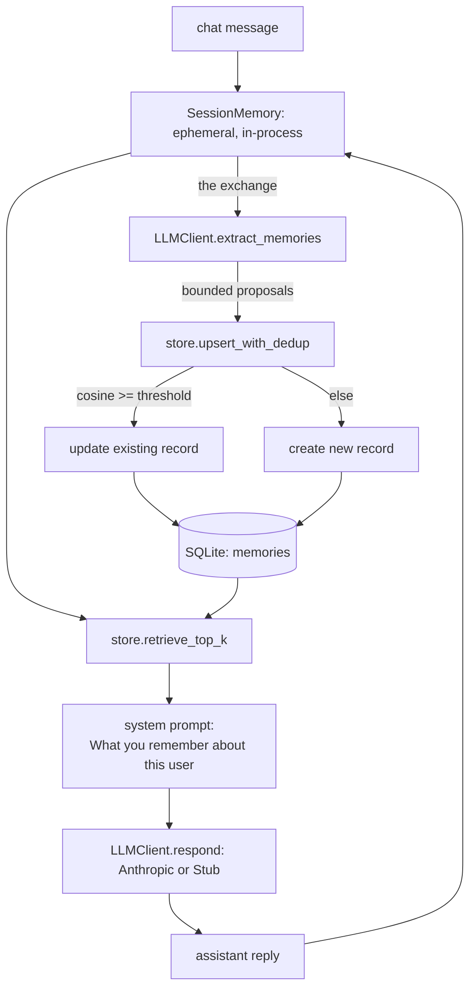

# 06 — Memory Agent

An agent with a real, testable difference between "remembers this conversation" and "remembers you."

Most chat demos call anything in the message list "memory," but that history
evaporates the moment the process exits. This starter keeps two genuinely
separate stores -- an ephemeral, in-process conversation list, and a
SQLite-backed store of discrete memory records that survives across
sessions and processes -- and proves the difference with a real two-session
transcript: session 1 establishes facts and exits; session 2, a brand new
process with an empty conversation history, answers correctly anyway.

## What it does

Every `chat` turn: retrieves the top-k most relevant persistent memories for
the incoming message (hashing bag-of-words embeddings + cosine similarity,
pure Python), injects them into the system prompt as a clearly separate
"What you remember about this user" block, gets a reply, then reviews the
exchange and proposes bounded memory writes (create/update/ignore). Each
proposed write is deduplicated against existing memories by embedding
similarity before it lands -- a near-duplicate updates the existing record
in place instead of creating a new one.

## Architecture



## When to use it

Use this pattern when an agent needs to recognize a returning user across
separate conversations -- a support bot that remembers a customer's plan, a
personal assistant that remembers stated preferences. Skip it for a single
uninterrupted conversation (plain message history is simpler and sufficient)
or for anything requiring true semantic recall at scale (the default
hashing embedder only catches literal vocabulary overlap; see Limitations).

## Folder structure

```
starters/06-memory-agent/
  src/memory_agent/
    session.py          # SessionMemory: ephemeral, in-process, zero I/O -- the "before" case
    store.py              # MemoryStore: SQLite persistence, retrieval, dedup-on-write -- the "after"
    embedder.py             # HashingEmbedder + cosine_similarity, pure Python (no numpy)
    llm.py                    # LLMClient seam: AnthropicClient (real) and StubClient (offline)
    chat.py                    # run_turn: retrieve -> respond -> extract -> bounded, deduped write
    demo.py                      # the two-session proof, run as two real subprocesses
    cli.py                        # chat / memories / forget / demo
    config.py                      # frozen Config dataclass from env
    logging_setup.py                # JSON-line structured logging
    errors.py                        # named exceptions
  tests/                               # see "How the flow works" for what each test proves
```

## Prerequisites

- Python 3.11+
- `uv` (recommended) or `pip`
- An Anthropic API key only if you want the real (non-`--offline`) model calls

## Setup

```bash
cd starters/06-memory-agent
cp .env.example .env   # optional -- only needed for the non---offline path
uv venv && uv pip install -e ".[dev]"
```

## Environment variables

| name | required? | default | what it is for |
|---|---|---|---|
| `ANTHROPIC_API_KEY` | no | unset | real model calls; without it, falls back to the offline stub automatically |
| `ANTHROPIC_MODEL` | no | `claude-opus-5` | model id for real calls |
| `LLM_PROVIDER` | no | `anthropic` | `anthropic` or `stub`; `stub` forces offline mode without `--offline` |
| `LOG_LEVEL` | no | `INFO` | structured JSON log verbosity |
| `MEMORY_AGENT_DB` | no | `memory_agent.db` | path to the SQLite persistent-memory database |
| `EMBEDDING_DIM` | no | `64` | hashing-embedder vector size |
| `RETRIEVAL_TOP_K` | no | `3` | how many memories to retrieve and inject per turn |
| `DEDUP_THRESHOLD` | no | `0.82` | cosine similarity above which a write updates instead of duplicates |
| `MAX_MEMORIES_PER_TURN` | no | `3` | hard cap on memory writes proposed per turn |

## Run it

The demo -- the whole point of this starter -- offline, no API key, no manual steps:

```bash
uv run python -m memory_agent demo --offline
```

It runs two real subprocesses (session 1's two turns, then session 2's one
turn) sharing a fresh `memory_agent_demo.db`, and prints the full transcript
of both plus a summary. See "Expected output" below for a real run.

Talk to it turn by turn (each invocation is a separate process by design --
see "How the flow works" for why):

```bash
uv run python -m memory_agent chat "I prefer Python over JavaScript for backend work." --session-id me --offline
uv run python -m memory_agent chat "What do I prefer for backend work?" --session-id me --offline
```

Inspect and manage persistent memory:

```bash
uv run python -m memory_agent memories
uv run python -m memory_agent forget <memory-id>
```

With a real key, drop `--offline` to route through `claude-opus-5`. Each
`chat` call makes up to 2 model calls (one reply, one memory-extraction
call); `demo` makes up to 6 across its three turns if run with `--live`.

## Example input

```bash
uv run python -m memory_agent chat "I live in Berlin. I'm allergic to peanuts." --session-id me --offline
```

## Expected output

Real, trimmed output from `demo --offline`:

```
=== turn 1: session-1 ===
session_id=session-1
you: I prefer Python over JavaScript for backend work.
remembered: (nothing remembered yet about this user)
assistant: [stub] Noted: "I prefer Python over JavaScript for backend work." (nothing relevant remembered yet).
memory: create (preference) User prefer Python over JavaScript for backend work. [id=051e47764c42]

=== turn 2: session-1 ===
session_id=session-1
you: I live in Berlin. I'm allergic to peanuts.
remembered: (preference, score=0.12) User prefer Python over JavaScript for backend work.
assistant: [stub] Based on what I remember about you: User prefer Python over JavaScript for backend work..
memory: create (fact) User live in Berlin. [id=b4fe9aaa4eee]
memory: create (fact) User is allergic to peanuts. [id=9b7e537d206e]

=== turn 3: session-2 ===
session_id=session-2
you: Do I prefer Python and where do I live?
remembered: (preference, score=0.37) User prefer Python over JavaScript for backend work.
remembered: (fact, score=0.26) User live in Berlin.
assistant: [stub] Based on what I remember about you: User prefer Python over JavaScript for backend work.; User live in Berlin..

=== summary ===
session 1 established facts across 2 turns, then exited.
session 2 started with an empty conversation history (a fresh process)
and answered using only persistent memory retrieved from disk:
  assistant: [stub] Based on what I remember about you: User prefer Python over JavaScript for backend work.; User live in Berlin..
```

Session 2's process never saw session 1's messages -- its own `you:` line is
only the question. The Python and Berlin facts reached it exclusively through
the `remembered:` block, retrieved from `memory_agent_demo.db`.

## How the flow works

**Two genuinely separate stores.** `session.SessionMemory` is a dataclass
around a list, with zero I/O -- it cannot leak data across processes because
it never touches disk. `store.MemoryStore` is SQLite-backed and outlives any
one process. The CLI's `chat` command is intentionally single-shot
(`chat "message" --session-id X`): each invocation is a new process with a
brand-new, empty `SessionMemory`, even when you reuse the same
`--session-id`. The id is only a label written to each memory's
`source_session_id` column, not a key that reloads prior turns. This is what
makes the separation real instead of asserted: there is no code path that
*could* leak conversation history across invocations, because none exists.

**Retrieval.** `HashingEmbedder` (in `embedder.py`) hashes each token with
`hashlib.sha256` into a fixed-size vector (deliberately not Python's builtin
`hash()`, which is randomized per process via `PYTHONHASHSEED` and would make
embeddings of identical text differ across the demo's subprocesses), then
L2-normalizes it. `retrieve_top_k` embeds the query, scores every stored
memory by cosine similarity (equivalent to a dot product once both sides are
unit vectors), keeps only positive scores, and returns the top k -- touching
`last_accessed_at` on everything it returns.

**Extraction and bounded, deduplicated writes.** After a reply, `extract_memories`
reviews the exchange and proposes up to a few `{action, content, category}`
writes. `chat.run_turn` caps the list at `MAX_MEMORIES_PER_TURN` regardless of
what the model returns. Each surviving proposal goes through
`store.upsert_with_dedup`: it embeds the proposed content, finds the existing
memory with the highest cosine similarity, and if that clears
`DEDUP_THRESHOLD` it updates that record in place (same id, new content) --
otherwise it inserts a new one. This dedup check runs in our own code, not
the model's, so it is enforced the same way regardless of which `LLMClient`
proposed the write.

**The offline stub is honest, not omniscient.** `StubClient.respond` never
invents a memory -- it can only repeat what retrieval already found in the
system prompt's "What you remember" block. `StubClient.extract_memories`
only proposes a write when a sentence *starts* with a first-person marker
("I prefer...", "I live...") -- anchored at the sentence start on purpose,
so a question that merely mentions "...do I prefer..." mid-sentence is not
mistaken for a statement about the user.

## Extension ideas

- Swap `HashingEmbedder` for a real semantic embedder (e.g. Voyage AI, the
  same upgrade path documented in the RAG starters) once retrieval needs to
  understand synonyms, not just shared tokens.
- Add a memory decay/expiry pass that prunes `episodic` memories nobody has
  accessed in N days, while keeping `preference`/`fact` memories indefinitely.
- Let `extract_memories` see a summary of existing memories so it can propose
  `"update"` against a specific id instead of relying purely on our own
  embedding-distance dedup to find the match.

## Limitations

- `HashingEmbedder` has no semantic understanding -- it cannot tell "I like
  tea" and "I enjoy hot beverages" are related; it only catches literal
  vocabulary overlap (and doesn't stem, so "prefer" and "prefers" are
  different tokens). This is a deliberate, honestly documented tradeoff for
  an offline-by-default starter with no embeddings API to call by default.
- The offline `StubClient`'s extraction is pattern-based (first-person
  sentence starts), not real language understanding -- it will miss implied
  preferences and will occasionally misfire on unusual phrasing.
- No memory expiry/decay: persistent memories accumulate forever unless
  removed with `forget`.
- Single-user, single-file SQLite: there's no user/tenant isolation column;
  every memory in one database belongs to one user's history.

## Troubleshooting

| symptom | cause | fix |
|---|---|---|
| `error: no memory with id ...` | typo'd id, or a different `MEMORY_AGENT_DB` than the one used at write time | `memories` to see valid ids; confirm the env var matches |
| `demo` shows the same facts every run even with `rm`'d db | `--db-path` defaults to `memory_agent_demo.db` in the current directory and is reset automatically each run -- check you're not passing a stale `--db-path` | omit `--db-path` or pass a fresh one |
| a new fact created a duplicate instead of updating | phrasing was too different from the existing memory to clear `DEDUP_THRESHOLD` | lower `DEDUP_THRESHOLD`, or accept that dissimilar phrasing of "the same" fact is a known limitation of a bag-of-words embedder |
| stub output where you expected real Claude output | no `ANTHROPIC_API_KEY` set, or `--offline`/`LLM_PROVIDER=stub` in effect | check the INFO log line explaining the fallback; set the key and drop `--offline` |
| `demo` subprocess fails | `python -m memory_agent` isn't importable from a subprocess (package not installed) | re-run `uv pip install -e ".[dev]"` in this directory |

## Production hardening

This is an educational starter, not a production memory system. Before
relying on it: add per-user/tenant isolation to the schema, move off a
hashing embedder to a real semantic one once quality matters, add a review
step (human-in-the-loop or a confidence threshold) before writing sensitive
personal facts, add memory expiry and a way for users to export/delete all
their data (not just one record at a time), and add monitoring for runaway
memory growth per user.
