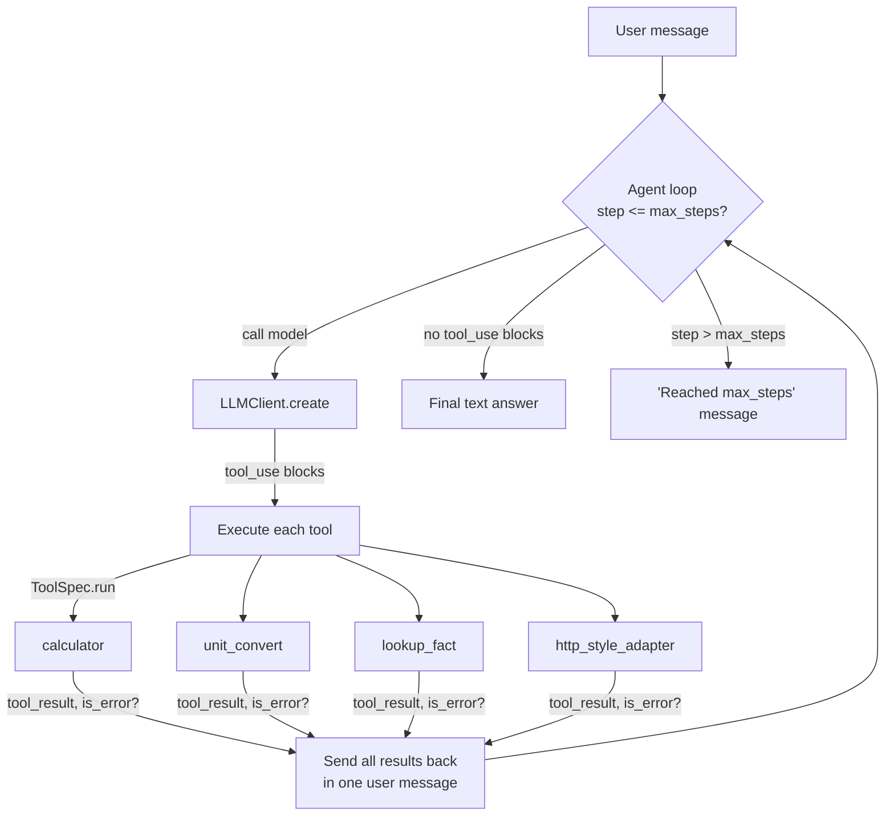

# 07 — Tool-Using Agent

A bounded, hand-rolled tool-calling loop that shows exactly how Claude's tool use works, end to end, with no framework in the way.

Most tool-use tutorials show one tool and a happy path. This starter ships four tools with genuinely different shapes — pure computation, a fixed lookup table, read-only local data, and a synthetic external-API adapter — routed by Claude through a small manual agentic loop with a hard step bound, strict JSON-schema validation, and explicit error handling so a bad tool call is reported back to the model instead of crashing the process.

## What it does

- Runs a bounded loop (`max_steps`, default 8): call Claude, execute any tool calls it asks for, feed the results back, repeat until Claude gives a final answer or the bound is hit.
- Ships four `"strict": True` tools: `calculator`, `unit_convert`, `lookup_fact`, `http_style_adapter`.
- Handles **parallel tool calls**: if one assistant turn contains several `tool_use` blocks, every one gets executed and all their `tool_result` blocks go back in a single user message.
- Validates tool input beyond the JSON schema (e.g. division by zero, unknown units, unknown topics, unknown cities) and returns `is_error: true` tool results instead of raising — the loop never crashes on a bad call.
- Runs fully offline via a deterministic stub client that picks a tool by keyword-matching the message, so the whole demo works with no API key.

## Architecture



## When to use it

Use this as a reference for building your own tool-calling loop by hand: routing, parallel calls, per-tool validation, and a hard iteration bound. Good starting point when you want full control over the loop (custom retry logic, human approval gates, non-standard transports) and don't want a beta SDK dependency.

Don't use it as-is for production traffic — the tools here are deliberately small and synthetic (a 4-operator calculator, a fixed unit table, ten knowledge-base entries, fake weather). Swap in real tools and keep the loop/validation/error-handling pattern.

## Folder structure

```
starters/07-tool-using-agent/
  src/tool_using_agent/
    __init__.py        # public exports
    __main__.py         # `python -m tool_using_agent ...`
    cli.py               # argparse CLI: chat, list-tools
    agent.py             # the bounded manual agentic loop
    llm.py                # AnthropicClient / StubClient / get_client()
    config.py             # env-driven Config, MissingCredentialsError
    logging_setup.py       # ~20-line JSON log formatter
    tools/
      base.py               # ToolError, ToolSpec
      calculator.py          # recursive-descent arithmetic parser
      unit_convert.py         # fixed length/weight/temperature table
      lookup_fact.py           # reads data/knowledge.json
      http_style_adapter.py     # synthetic weather adapter
  data/knowledge.json    # 10-entry local knowledge base
  tests/                  # pytest, offline only
```

## Prerequisites

- Python 3.11+
- [uv](https://docs.astral.sh/uv/) (or `pip`) for dependency management
- An Anthropic API key only if you want live calls — see [Environment variables](#environment-variables)

## Setup

```bash
cd starters/07-tool-using-agent
uv venv --python 3.13
uv pip install -e ".[dev]"
cp .env.example .env   # optional — only needed for live calls
```

## Environment variables

| Name | Required? | Default | What it is for |
|---|---|---|---|
| `ANTHROPIC_API_KEY` | No | unset | Live Claude calls. Without it (and without `--offline`), the CLI logs one line and falls back to the offline stub. |
| `ANTHROPIC_MODEL` | No | `claude-opus-5` | Model id for live calls. |
| `LLM_PROVIDER` | No | unset (auto) | `anthropic` or `stub`. Auto-selects `anthropic` when a key is set, else `stub`. |
| `LOG_LEVEL` | No | `INFO` | `DEBUG`/`INFO`/`WARNING`/`ERROR` for the JSON logger. |
| `AGENT_MAX_STEPS` | No | `8` | Loop bound; overridable per call with `--max-steps`. |

## Run it

Offline (no API key, no network — this is the primary way to try the starter):

```bash
uv run tool-using-agent list-tools
uv run tool-using-agent --offline chat "What is 12 * (3 + 4)?"
uv run tool-using-agent --offline chat "What's the weather in Tokyo?"
uv run tool-using-agent --offline chat "Convert 10 km to miles"
uv run tool-using-agent --offline chat "Tell me about black holes"
```

Also runnable as a module:

```bash
uv run python -m tool_using_agent --offline chat "What is 6 * 7?"
```

With a real key (billed — one `messages.create` call per loop step, typically 1-3 steps per message):

```bash
export ANTHROPIC_API_KEY=sk-ant-...
uv run tool-using-agent chat "What is 12 * (3 + 4)?"
```

Run the tests (offline, no network, under 2 seconds):

```bash
uv run pytest -q
```

## Example input

```
uv run tool-using-agent --offline chat "What is 12 * (3 + 4)?"
```

## Expected output

Real output from the command above (stderr log/tool lines and stdout final answer, both shown; trimmed of nothing):

```
{"ts": "2026-09-08T14:25:50Z", "level": "INFO", "logger": "tool_using_agent.llm", "msg": "offline mode requested; using the stub client"}
[tool] calculator({'expression': '12 * (3 + 4)'}) -> ok: 12 * (3 + 4) = 84
Here's what I found: 12 * (3 + 4) = 84
```

And an error path (`uv run tool-using-agent --offline chat "What's the weather in Atlantis?"`), showing a failed tool call reported back to the model instead of crashing:

```
[tool] http_style_adapter({'city': 'Atlantis'}) -> ERROR: Unknown city 'Atlantis'. Known cities: Cairo, London, Mumbai, New York, Paris, Reykjavik, Sydney, Tokyo.
I couldn't complete that: Unknown city 'Atlantis'. Known cities: Cairo, London, Mumbai, New York, Paris, Reykjavik, Sydney, Tokyo.
```

## How the flow works

- **The loop is manual on purpose.** `agent.py` hand-writes `for step in range(1, max_steps + 1): ...` instead of using the SDK's beta tool runner, so the mechanics — appending the assistant turn, executing tools, batching `tool_result` blocks, checking the bound — are all visible and easy to modify.
- **Parallel tool calls are a first-class case, not an afterthought.** Every `tool_use` block in one assistant turn is collected, executed, and answered in a *single* subsequent user message (see `test_parallel_tool_calls_all_get_results_in_one_message` in `tests/test_agent_loop.py`). Splitting results across multiple messages is a common bug that silently trains the model to stop batching calls.
- **Tools validate themselves.** The JSON schema (`strict: True`, `additionalProperties: False`) only constrains shape — it can't express "no division by zero" or "this city isn't in the table." Each tool's `run()` does that validation and raises `ToolError`; the loop catches it and returns `is_error: true` instead of raising through the loop.
- **The stub is keyword-routed, not random.** `StubClient` looks at the user's message for "weather", "convert ... to ...", an arithmetic pattern, or falls back to a fact lookup, so the same input always produces the same tool call — useful for both the offline demo and deterministic tests.
- **`http_style_adapter` is the interesting one.** It has the shape of a real API integration (validate request -> "call" -> shape response -> handle unknown-city error) with zero network I/O. The response payload carries `"synthetic": true` so nothing downstream can mistake it for live data — see the module docstring in `tools/http_style_adapter.py`.

## Extension ideas

- Add a real HTTP-backed tool (e.g. via `urllib.request`) alongside `http_style_adapter` and compare the two side by side.
- Add a tool that calls another Claude request internally (a sub-agent), to see how nested tool use composes with the step bound.
- Persist `AgentResult.tool_calls` to a file per run — this is exactly the kind of trace starter 08 (agent evals & observability) formalizes.

## Limitations

- `calculator` supports only `+ - * / ( )` and decimals — no exponents, functions, or variables, by design.
- `unit_convert`'s table is small and fixed; there's no unit-string fuzzing (e.g. it won't guess that "kmh" means km).
- `lookup_fact`'s knowledge base has 10 entries. It's a demonstration of the read-only-local-data pattern, not a real corpus.
- `http_style_adapter` covers 8 fixed cities with fixed, synthetic weather — it is not live data and never will be, by design.
- `StubClient`'s keyword routing is intentionally simple; it is a deterministic demo double, not a natural-language understanding system.

## Troubleshooting

| Symptom | Cause | Fix |
|---|---|---|
| `error: ANTHROPIC_API_KEY is not set...` | `LLM_PROVIDER=anthropic` explicitly set but no key in the environment | Add the key to `.env`, or unset `LLM_PROVIDER`, or pass `--offline` |
| CLI prints an `INFO` JSON line about falling back to the stub | No `ANTHROPIC_API_KEY` and no `--offline` flag | Expected — either add a key or pass `--offline` to silence the log |
| `Reached max_steps (N) without a final answer.` | The model kept calling tools past the bound | Raise `--max-steps`, or check whether a tool is looping (e.g. always erroring) |
| `ruff format` reports a diff | Code not run through the formatter yet | `uv run ruff format .` |

## Production hardening

- Add retries with backoff around `AnthropicClient.create` for `RateLimitError`/`APIStatusError` (the SDK already retries 429/5xx by default — tune `max_retries` if needed).
- Replace `http_style_adapter`'s fixed table with a real HTTP client, keeping the same validate/call/shape/error structure, and add request timeouts.
- Add structured tracing per tool call (name, input, latency, success) — see starter 08 for a full pattern.
- Consider a per-tool allowlist/rate limit if tools have side effects or hit paid external APIs.
