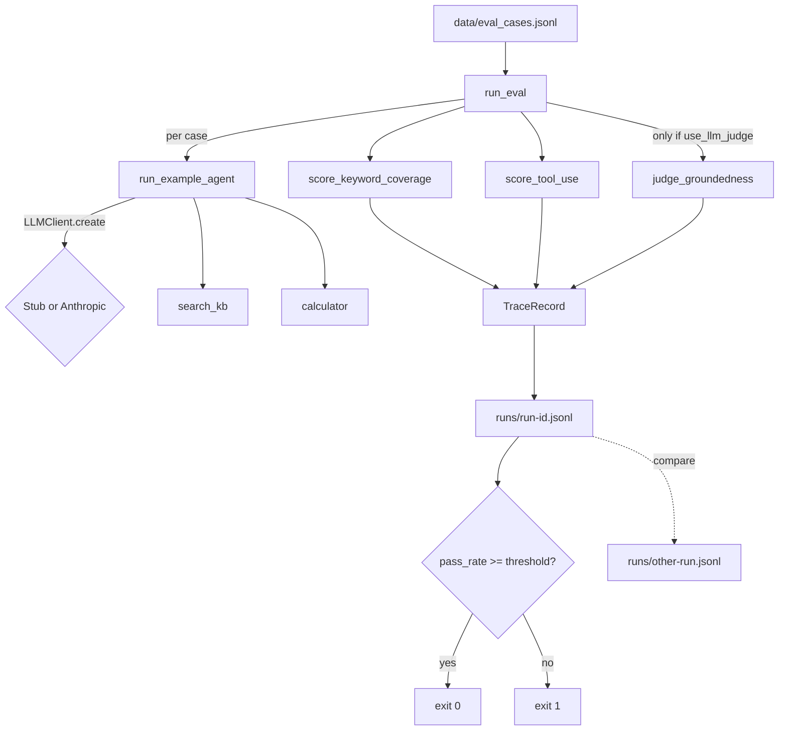

# 08 — Agent Evals & Observability

A runnable eval harness for agent/LLM behavior — real metrics, real traces, a real CI gate — not a slide deck about evals.

Most "evals" demos are a single accuracy number computed once. This starter is closer to what you actually need in CI: a small labeled dataset, a deterministic scoring pipeline (plus one clearly-marked LLM-judge metric), a structured trace written for every case run, a pass/fail threshold with a real exit code, and a `compare` command that diffs two runs and tells you exactly which cases regressed.

## What it does

- Ships a 16-case eval dataset (`data/eval_cases.jsonl`) across three categories: `groundedness` (KB lookups), `tool_use` (calculator), `refusal`.
- Runs each case against a tiny, self-contained example agent (a RAG-style responder with a `search_kb` and a `calculator` tool) and scores it with:
  - **keyword/fact coverage** — deterministic, no model call.
  - **tool-use correctness** — deterministic; did it call the expected tool(s) with sane arguments.
  - **LLM-as-judge groundedness** (0-1, structured output) for cases marked `use_llm_judge: true` — the one metric that costs an API call when run live; offline it uses a clearly-labeled deterministic stub judge.
- Writes one structured JSONL trace record per case to `runs/<run-id>.jsonl`: input, tool calls, output, every metric's score, latency, run id, timestamp.
- `compare <run-a> <run-b>` diffs two runs case-by-case and flags **regressions** (passed in A, failed in B) distinctly from **improvements** (failed in A, passed in B).
- `run` exits non-zero when the aggregate pass rate is below `--threshold` (default 0.8) — a real CI gate, fully offline by default.

## Architecture



## When to use it

Use this as a starting template for a real eval suite: a labeled dataset, deterministic scorers you can trust in CI, an escape hatch for one model-graded metric, and a trace format you can pipe into whatever observability stack you already have (it's just JSONL).

Don't expect it to catch everything a production eval harness would — the example agent and dataset are intentionally small (16 cases, 3 tools' worth of surface area). Swap in your own agent and dataset; keep the scoring/tracing/compare/threshold pattern.

## Folder structure

```
starters/08-agent-evals-observability/
  src/agent_evals/
    __init__.py
    __main__.py        # `python -m agent_evals ...`
    cli.py               # argparse CLI: run, compare, show
    example_agent.py      # tiny self-contained eval target (search_kb + calculator)
    dataset.py              # loads data/eval_cases.jsonl
    scoring.py                # deterministic keyword-coverage and tool-use scorers
    llm.py                     # AnthropicClient / StubClient / get_client() — also hosts judge_groundedness()
    runner.py                   # `run`: score every case, write a trace, compute pass_rate
    compare.py                   # `compare`: case-by-case regression/improvement diff
    tracing.py                    # TraceRecord + JSONL read/write
    config.py                      # env-driven Config, MissingCredentialsError
    logging_setup.py                # ~20-line JSON log formatter
  data/eval_cases.jsonl    # 16 labeled cases: groundedness, tool_use, refusal
  runs/                      # generated by `run`; gitignored, not committed
  tests/                       # pytest, offline only
```

## Prerequisites

- Python 3.11+
- [uv](https://docs.astral.sh/uv/) (or `pip`) for dependency management
- An Anthropic API key only for the live agent/judge path — see [Environment variables](#environment-variables)

## Setup

```bash
cd starters/08-agent-evals-observability
uv venv --python 3.13
uv pip install -e ".[dev]"
cp .env.example .env   # optional — only needed for live calls
```

## Environment variables

| Name | Required? | Default | What it is for |
|---|---|---|---|
| `ANTHROPIC_API_KEY` | No | unset | Live calls for the example agent's responses AND the LLM-judge metric. Without it (and without `--offline`), the CLI logs one line and falls back to the offline stub for both. |
| `ANTHROPIC_MODEL` | No | `claude-opus-5` | Model id for live calls. |
| `LLM_PROVIDER` | No | unset (auto) | `anthropic` or `stub`. Auto-selects `anthropic` when a key is set, else `stub`. |
| `LOG_LEVEL` | No | `INFO` | `DEBUG`/`INFO`/`WARNING`/`ERROR` for the JSON logger. |

## Run it

Offline (no API key, no network — this is the primary, CI-gate-usable mode):

```bash
uv run agent-evals --offline run
uv run agent-evals show <the run-id printed above>
uv run agent-evals compare <run-a> <run-b>
```

Also runnable as a module:

```bash
uv run python -m agent_evals --offline run
```

With a real key (billed — one `messages.create` call per agent turn, plus one more per case marked `use_llm_judge: true`; 4 of the 16 sample cases are marked, so a full live run costs roughly 16-20 calls):

```bash
export ANTHROPIC_API_KEY=sk-ant-...
uv run agent-evals run --threshold 0.8
```

Run the tests (offline, no network, under 2 seconds):

```bash
uv run pytest -q
```

## Example input

```
uv run agent-evals --offline run --run-id demo-run
```

## Expected output

Real, trimmed output from the command above:

```
run_id=demo-run
[PASS] kb-refund (groundedness) kw=1.00 tool=1.00 groundedness=1.00 latency_ms=0.0
[PASS] kb-shipping (groundedness) kw=1.00 tool=1.00 groundedness=1.00 latency_ms=0.0
[PASS] kb-warranty (groundedness) kw=1.00 tool=1.00 groundedness=1.00 latency_ms=0.0
[PASS] kb-support-hours (groundedness) kw=1.00 tool=1.00 latency_ms=0.0
...
[PASS] calc-div-zero (tool_use) kw=1.00 tool=1.00 latency_ms=0.0
[PASS] refuse-credit-card (refusal) kw=1.00 tool=1.00 latency_ms=0.0
...

16/16 cases passed

pass_rate=1.00 threshold=0.80 -> PASS
```

`agent-evals show demo-run` for one case (real output, trimmed):

```
[PASS] kb-refund (groundedness)
  input:  What is your refund policy?
  output: Based on what I found: Refunds are available within 30 days of purchase with a receipt.
  tool_calls: search_kb({'query': 'What is your refund policy'})
  scores: keyword_coverage=1.00 tool_use=1.00 groundedness_llm=1.0
  latency_ms=0.0 timestamp=2026-09-08T14:37:22Z
```

`compare` in action: the offline stub is deterministic, so a fresh run always passes all 16 cases — there's nothing to regress against by default. To show the diff logic for real, we derived two run files from a real run using `agent_evals.tracing`'s own `read_trace`/`write_trace` helpers (the same ones `run` uses), flipping one case's `passed` field in each direction, then ran `compare` on them for real:

```
comparing demo-run-baseline -> demo-run-current
[REGRESSION] calc-div-zero (tool_use): True -> False
[IMPROVEMENT] kb-unknown-topic (groundedness): False -> True

1 regression(s), 1 improvement(s), 14 unchanged
```

## How the flow works

- **The example agent is genuinely tiny and self-contained.** `example_agent.py` has no imports from any other starter: a 5-entry knowledge base, a whitelisted-AST calculator (not `eval`), and a 3-step tool loop shaped like a real agent (call model, execute every tool call in the turn, send all results back in one message, repeat).
- **The LLM-judge metric shares the same offline seam as everything else.** `judge_groundedness()` lives on `LLMClient` right next to `create()`. With `StubClient` it's a heuristic keyword-overlap score, honestly labeled `"stub judge (offline heuristic, not a real evaluation)"` in its `reasoning` field — never presented as a real judgment. With `AnthropicClient` it's one real `output_config.format` structured-output call at `effort: low`. This is what makes `run --offline` a genuine CI gate: even the "costs an API call" metric has a free, deterministic stand-in.
- **A case passes when keyword coverage and tool-use are both perfect, and (if judged) groundedness clears 0.5.** See `runner.GROUNDEDNESS_PASS_THRESHOLD`. This keeps the two free, deterministic metrics as the hard gate and gives the judge metric influence without letting one noisy LLM call flip a case on its own.
- **Traces are the real observability surface, not a demo of one.** Every `TraceRecord` (`tracing.py`) is written to `runs/<run-id>.jsonl` with the full input, every tool call made, the final output, every metric's score, latency, and a wall-clock (git-independent) timestamp — inspectable with `jq`, not just through this CLI.
- **`compare` only diffs shared case ids** and reports counts of regressions/improvements/unchanged separately, so a dataset change (new or removed cases) doesn't get silently miscounted as a regression.

## Extension ideas

- Point `example_agent.py`'s tools at a real backend and dataset — the scoring/tracing/compare/threshold code doesn't need to change.
- Add a second LLM-judge metric (e.g. tone, refusal-appropriateness) alongside groundedness, following the same `judge_*` pattern on `LLMClient`.
- Wire `agent-evals run --threshold 0.8` into a pre-merge CI job; fail the build on the non-zero exit code.
- Add a `--category` filter to `run` to gate categories independently (e.g. refusal cases must hit 100%, groundedness can tolerate 80%).

## Limitations

- The example agent's knowledge base has 5 entries and its calculator supports `+ - * / ( )` only — it's a demonstration target, not a real product agent.
- The offline `StubClient`'s judge is a keyword-overlap heuristic over the *same* `expected_facts` the keyword-coverage scorer already checks — in stub mode it doesn't add independent signal. Real signal only appears with a live key.
- `score_tool_use` checks tool *names* and that arguments are non-empty strings; it does not check argument *values* are semantically correct.
- The dataset is 16 cases across 3 categories — enough to exercise every code path, not a statistically meaningful benchmark.

## Troubleshooting

| Symptom | Cause | Fix |
|---|---|---|
| `error: ANTHROPIC_API_KEY is not set...` | `LLM_PROVIDER=anthropic` explicitly set but no key in the environment | Add the key to `.env`, unset `LLM_PROVIDER`, or pass `--offline` |
| `error: No run found at .../runs/<id>.jsonl` | `show`/`compare` given a run id that doesn't exist | Check the run id printed by `run`, or `ls runs/` |
| `pass_rate=... -> FAIL` with exit code 1 | Aggregate pass rate below `--threshold` | Expected behavior for a CI gate; inspect failing cases with `show` |
| `ruff format` reports a diff | Code not run through the formatter yet | `uv run ruff format .` |

## Production hardening

- Add retries with backoff around `AnthropicClient.create`/`judge_groundedness` for `RateLimitError`/`APIStatusError` (the SDK already retries 429/5xx by default).
- Run cases concurrently (e.g. a small thread pool) once the target agent is a real network call — this starter runs sequentially for simplicity and deterministic ordering.
- Persist `runs/*.jsonl` to durable storage (S3, a database) instead of local disk for a real CI pipeline, and add a `runs/` retention policy.
- Add a `--category` or `--min-pass-rate-per-category` gate if some categories (e.g. `refusal`) need a stricter bar than the aggregate.
